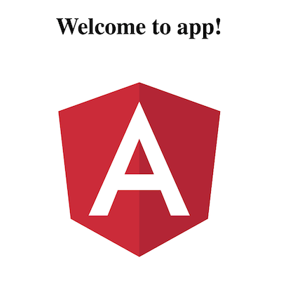

[](https://generalassemb.ly/education/web-development-immersive)

<!--WDi5 11:44 -->

# Angular Basics


**Angular** is a superior front-end framework.

## Objectives

By the end of this lesson, you will be able to:

-   Define the Angular CLI.
-   Download and install `@angular/cli` and scaffold a new Angular app.
-   Understand the basics of how an Angular app is composed.

## What is the Angular CLI?

The Angular command line interface (CLI) is a tool that allows us to serve up our Angular app, run tests, and generate code. In the recent past, we had to install our own web servers, set up our own testing and bundling infrastructure, and write all of our own code. Those days are behind us. The Angular CLI is a one-stop shop for all of the tools and tasks we need to build up our web app.

## Install `@angular/cli`


Let's install it globally:

```sh
npm install -g @angular/cli
```

To verify that Angular install properly, run the command `ng -v`. You should see a response that looks something like this:

```bash
@angular/cli: 1.4.9
node: 8.1.4
os: darwin x64
```

## From Nil to Angular App in Five Seconds

The Angular CLI lets us scaffold an application quickly and run it. Let's create an Angular application called **ga-ui**.

Type:

```bash
ng new ga-ui
```

What did that do? The Angular CLI has set up a basic Angular application for us! We can just edit it from here. You can always use `ng new ___` to quickly scaffold a new Angular application.


Then let's move into the new directory:

```bash
cd ga-ui
```

We should be able to run our web application immediately!

```bash
ng serve
```

Open your browser to `http://localhost:4200/` - there is a basic Angular application created for us!



<!--WDI5 11:58  -->

## Angular Tools

Before we dive into the structure of the app, let's quickly cover all of the built-in tools Angular provides.

To run our app (and lint and watch):

```bash
ng serve
```

To run our unit tests:

```bash
ng test
```

To run our linter:

```bash
ng lint
```

There are a variety of other tools available, each with many, many configurations. To see a full list, type:

```bash
ng help
```

## Angular 2 Application Structure

Our scaffolded application looks like this:

```bash
├── README.md
├── node_modules
├── e2e
│   ├── app.e2e-spec.ts
│   ├── app.po.ts
│   └── tsconfig.e2e.json
├── karma.conf.js
├── package.json
├── protractor.conf.js
├── src
│   ├── app
│   │   ├── app.component.css
│   │   ├── app.component.html
│   │   ├── app.component.spec.ts
│   │   ├── app.component.ts
│   │   └── app.module.ts
│   ├── assets
│   ├── environments
│   │   ├── environment.prod.ts
│   │   └── environment.ts
│   ├── favicon.ico
│   ├── index.html
│   ├── main.ts
│   ├── polyfills.ts
│   ├── styles.css
│   ├── test.ts
│   ├── tsconfig.app.json
│   ├── tsconfig.spec.json
│   └── typings.d.ts
├── tsconfig.json
└── tslint.json
```

At the root of our application, we have:
- A `README`
- A folder for our end-to-end tests
- The `src` folder where our code will live
- A series of configuration files.
  - These config files relate to TypeScript and its linting.
  - We won't be touching any files that live here or in the end-to-end folder.

In `src`, we'll find all of the files that are important to us (and a few more configuration files we'll be ignoring):
- `index.html`
  - Like with most web frameworks, we'll leave this largely untouched.
- A few more TypeScript and test configuration files that suit us as is.
- A `polyfill.ts` file
  - The Angular CLI mercifully supplies to ensure our code works well on all browsers.
- `main.ts`
  - where our app is bootstrapped. This file is very important but works just fine as is.
- An `app` folder
  - This houses our first component! We'll take a deeper dive into this folder in a minute.

## Starting From Our Bootstraps

Let's take a look at `main.ts`:

```TypeScript
import { enableProdMode } from '@angular/core';
import { platformBrowserDynamic } from '@angular/platform-browser-dynamic';

import { AppModule } from './app/app.module';
import { environment } from './environments/environment';

if (environment.production) {
  enableProdMode();
}

platformBrowserDynamic().bootstrapModule(AppModule);
```

Look at all of those imports! We have the modularity of Angular 2 on display here.
- We pluck a few modules from Angular 2 and **the component we generated**, and then bootstrap our module to make it the root of our application.

Advanced Angular developers can tweak this bootstrapping process for their projects' specific requirements, but **all we care about here is that the last line is where our component becomes an application.**

## Our Root Component

At this point you may be asking yourself, "Where will I write code?" For that, we turn to our root component — the app component in the `app` folder.

With `app.component.html`, we see our first Angular 2 template:

```html
  <h1>
    Welcome to {{title}}!
  </h1>
```

Angular uses a double-bracket binding syntax for JavaScript, which is pretty common among front-end frameworks and template libraries. We're calling JavaScript in the HTML.

Looking through the rest of `app.component.html`, you can see that it defines the HTML for the page.

But what about that variable `{{title}}`? The values in brackets will be replaced by values in our next file, `app.component.ts`. At the bottom of this file, we declare the variable `title` and give it the value of `app`.

```typescript
@Component({
  selector: 'app-root',
  templateUrl: './app.component.html',
  styleUrls: ['./app.component.css']
})
export class AppComponent {
  title = 'app';
}
```

## Testing It Out

Browse to `http://localhost:4200` in your browser and see your default application. At the top, you can see "Welcome to app!"

Go into `app.component.ts` and change the `title` variable value to `My Website`:

`title = 'My Website';`

This will change what's passed into `app.component.html`, and therefore change what's displayed on the screen. Go back to your browser, and you'll see your new title.

Isn't that cool?  You don't even need to refresh the browser.  This is called "Live Reloading", and will save you a lot of development time.

## Wrapping Up

By now, you should have a broad, though shallow, understanding of how an Angular app is put together. We covered a lot of ground very quickly this lesson, so don't worry if you're not ready to remake Facebook in Angular just yet. In the coming lessons, we'll flesh out your understanding so you'll be ready to go out and conquer the world of front-end web development.

<!--WDI5 12:16 -->

## References

-   [Angular CLI GitHub Page](https://github.com/angular/angular-cli)
-   [Official Angular Documentation](https://github.com/angular/angular-cli)

## [License](LICENSE)

1)  All content is licensed under a CC­BY­NC­SA 4.0 license.
2)  All software code is licensed under GNU GPLv3. For commercial use or
    alternative licensing, please contact legal@ga.co.
