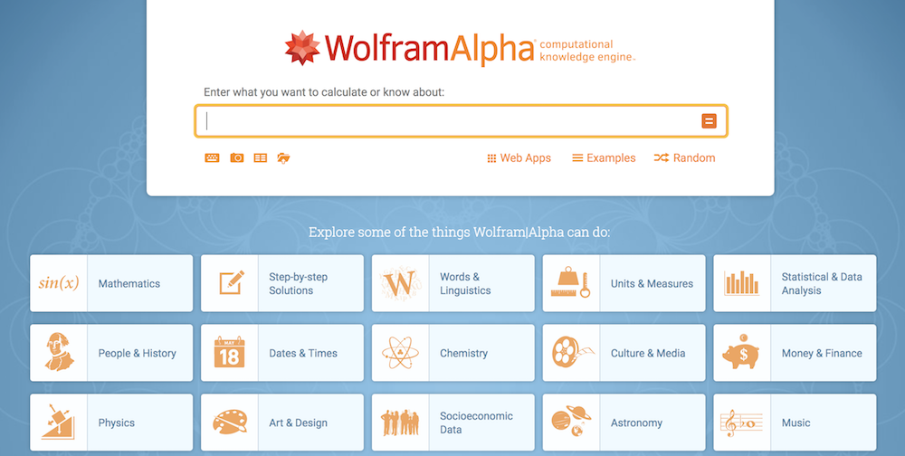

<!-- note: components match React module -->

[](https://generalassemb.ly/education/web-development-immersive)

<!--WDI5 12:17 -->

# Angular 2: Components & Modules


Keeping our code DRY (don't repeat yourself) and KISS compliant by using Angular components.

## Objectives

By the end of this lesson, you will be able to:

-  Use the Angular CLI to generate new components.
-  Use simple directives to make a component dynamic and interactive.
-  Generate and use services to abstract out business logic.
-  Use feature modules to organize their code.

## Angular Components

We've used the term "component" a lot recently, but what exactly **is** a component?

Generally speaking, a component is a reusable piece of code that addresses a specific concern. When developers separate their concerns successfully, the result is a series of reusable components that can be composed differently to create new applications. Components are pieces of our application that we can define once and reuse all over the place.

Angular 2 leans heavily into component structure. Everything is a component.

If you're used to writing out all of a page's view in a single HTML file, using components is a very different way of approaching web development.

When using Angular, building components will be your main front-end task.
- Because they're so encapsulated, components make it easy to reuse your code, test, and separate concerns.

### Identifying Components

Take a look at [Wolfram Alpha](https://www.wolframalpha.com/) (note: right click to open in a new tab!).



Each explore link is a component. How can you identify this?
- Listings look identical in structure, but have different information populating them
- Listings are dynamically generated based on the user's search

<!--WDI5 12:25 -->

Now, go to [Pacific Standard](https://psmag.com/) (note: right click to open in a new tab!).

Scrolling down it, identify the visual "components" the website is comprised of. We suggest drawing this out on paper!

As you're drawing this out, think about the following questions...
* Where do you see "nested components;" that is, where are there components inside another component? Where do you see just one "layer" instead?
* Are there any components that share the same structure?
* For components that share the same structure, what is different about them?

Here's a basic component tree in Angular:


What does an Angular 2 component look like?

Our `app` component is composed of five files:

```bash
├── app.component.css
├── app.component.html
├── app.component.spec.ts
├── app.component.ts
└── app.module.ts
```

This component creates what we see.

Besides the module file, which can be unique to the root component, the Angular 2 development team wants **all of our components to be a subset of this structure**.

We'll put all of the styles that pertain to our component in `app.component.css`. Sick of namespacing your styles to avoid collisions? Angular 2 has you covered — these styles **are scoped exclusively to its component.** (Right now, we only have the `App` component - but later, we'll have more!)

All of our unit tests for the component will live in `app.component.spec.ts`. We'll dive into testing a little later, but for now, just know that Angular 2 natively supports the Jasmine testing framework.

With `app.component.html`, we have our Angular template:

```html
  <h1>
    Welcome to {{title}}!
  </h1>
```

As you saw, the values in brackets will be replaced by values in our next file, `app.component.ts`.

```typescript
@Component({
  selector: 'app-root',
  templateUrl: './app.component.html',
  styleUrls: ['./app.component.css']
})
export class AppComponent {
  title = 'My Website';
}
```

What else is in this file?

- Here we see the definition of our component class, as well as our first use of a **decorator**, namely `@Component`.
  - Statements that look like @SomeName are called decorators. Decorators are an extension to JavaScript. Decorators let programmers modify and/or tag methods, classes, properties and parameters. Here, we're tagging these properties as a Component.
- Our component's **selector** is the name of the HTML element we use to summon the component in our templates.
  - Thus, this component is saying "Find `<app-root>` in the HTML file, and put this there."
  - If you look at your `index.html` file, you'll see:

```html
<body>
  <app-root></app-root>
</body>
```

That's our component!

The next two properties of our component's decorator argument are relative paths to the template and the component's style sheet.
- `templateUrl: './app.component.html'`
- `styleUrls: ['./app.component.css']`

These metadata properties are added to our component class at run time.
  - For a full list of metadata properties that our component decorator recognizes, [check out the documentation](https://angular.io/docs/ts/latest/api/core/index/Component-decorator.html).

In the class itself, we see one property being set. `{ title = 'My Website'; }`

The scope of an instance of this class will serve as the **view model** for our component. It connects our data **model** and the **view** the user sees. For example, that `title` we saw earlier in the template will be bound to the value of our instance's `title` property.


The last file of interest here is `app.module.ts`.
- Here, our app component is neatly packaged up to be exported and then bootstrapped - it's a long file, but the last two lines are the important ones.

```typescript
import { BrowserModule } from '@angular/platform-browser';
import { NgModule } from '@angular/core';
import { FormsModule } from '@angular/forms';
import { HttpModule } from '@angular/http';

import { AppComponent } from './app.component';

@NgModule({
  declarations: [
    AppComponent
  ],
  imports: [
    BrowserModule,
    FormsModule,
    HttpModule
  ],
  providers: [],
  bootstrap: [AppComponent]
})
export class AppModule { }
```

That's it! We've reviewed all of the working parts of 95 percent of Angular components. Our first component may be exceedingly simple, but we'll add more spice to our components in the following sections.

### Code-Along: Our Second Component

Let's work together to add a second component, `MasterSword`, to our fledgling app from earlier. The Angular CLI makes this easy.

`ng generate component ___` says "Create a new component." Then, you add the component name you want. We'll make a component called `master-sword`.

In your terminal, in the root of this application directory (`src/app`), type:

```bash
ng generate component master-sword
```

Note: You could also create a component with shorthand: `ng g c ___`.

Your console output should look like this:

```bash
installing component
  create src/app/master-sword/master-sword.component.css
  create src/app/master-sword/master-sword.component.html
  create src/app/master-sword/master-sword.component.spec.ts
  create src/app/master-sword/master-sword.component.ts
  update src/app/app.module.ts
```

Boom! The Angular CLI does most of the heavy lifting for us. It creates a new component directory nested within the root component directory and fills it out with all of the files that will compose our new component.

Also, if we turn to our `app.module.ts`, we'll see that the component has already been declared for us.

```typescript
import { BrowserModule } from '@angular/platform-browser';
import { NgModule } from '@angular/core';
import { FormsModule } from '@angular/forms';
import { HttpModule } from '@angular/http';

import { AppComponent } from './app.component';
import { MasterSwordComponent } from './masterSword/master-sword.component';

@NgModule({
  declarations: [
    AppComponent,
    MasterSwordComponent
  ],
  imports: [
    BrowserModule,
    FormsModule,
    HttpModule
  ],
  providers: [],
  bootstrap: [AppComponent]
})
export class AppModule { }
```

Let's give our template some flavor:

```html
<h1>{{proclamation}}</h1>

```

Make our implicitly scoped style sheet spicy:

```css
h1 {
  background-color: red;
}
```

And modify our component view model slightly:

```typescript
import { Component, OnInit } from '@angular/core';

@Component({
  selector: 'app-master-sword',
  templateUrl: './master-sword.component.html',
  styleUrls: ['./master-sword.component.css']
})
export class MasterSwordComponent implements OnInit {

  //Create the proclamation variable for the view model
  proclamation: string = 'Behold! The Master Sword!';

  constructor() { }

  ngOnInit() {
  }

}
```

Finally, we'll use it in `app.component.html`:

```html
<app-master-sword></app-master-sword>
```

#### Test It Out

Now run `ng serve` in your `ga-ui` folder, and navigate to `localhost:4200` in your browser. Look at that sword!


### Lab: Make Your Own Component

Use the Angular CLI to generate a `hylian-shield` component. Have the component display a picture of a hylian shield and text that reads "Behold! The Hylian Shield!" with a blue background.

<!-- Reference: WDI4 done with shield @ 9:47 -->

## Services: Abstracting and Reusing Business Logic

All of the components we've looked at so far have been pretty basic. They have merely bound hard-coded data from our component classes to their corresponding templates. What if we want to write code that multiple different components can use?

Services are a way to abstract out business logic into a form that allows us to use it anywhere in our app. At boot, our app creates a single instance of the service. Through a few lines of code, we can incorporate this instance wherever we want.

### Code-Along: Our First Service

At the moment, we have two components that render different items, but what if we want both of those items to be owned by the same person? We could either hard-code our information in both components (bad!) or use a service to share the logic (good!).

Let's go behind door number two.

First, let's create a directory to house all of the services for our app:

```bash
mkdir src/app/services
```

Then, create a directory to house our specific service:

```bash
mkdir src/app/services/user
```
Now, with our scaffolding in place, we can generate our service:

```bash
cd src/app/services/user
ng g s user
```

You should see this console output:

```bash
installing service
  create src/app/services/user/user.service.spec.ts
  create src/app/services/user/user.service.ts
  WARNING Service is generated but not provided, it must be provided to be used
```

<!-- @9:52 WDI4 turning over to devs, coming back @ 9:58, some people saw the service installing into /src/app even though they were in the /services/user folder -->

Our generator created our service and a test file for it. It's also warning us that we still need to **provide** our service to use it. Let's go ahead and do that.

You may have noticed an empty `providers` array property in our `app.module` when we first looked at it. If we add a reference to our service class to our array...

```typescript
// Import UserService
import { UserService } from './services/user/user.service';

@NgModule({
  declarations: [
    AppComponent,
    MasterSwordComponent,
    HylianShieldComponent
  ],
  imports: [
    BrowserModule,
    FormsModule,
    HttpModule
  ],
  //And add it to providers
  providers: [
    UserService
  ],
  bootstrap: [AppComponent]
})
export class AppModule { }
```

...Our application will create a single instance of our service on boot and allow us to incorporate that instance into as many of our components (and other Angular entities) as we want.

Our service is pretty useless at the moment, so let's add a method:

```typescript
import { Injectable } from '@angular/core';

@Injectable()
export class UserService {

  constructor() { }

  //Our new method
  getUsername(): string {
    return 'Link';
  }

}
```

<!--10:04 WDI4 -->

Our new method approximates an AJAX request (don't worry; we'll get to that in a later lesson) and returns something useful to both of our components.

Returning to our `MasterSword` component, we can now inject the service by importing the service class into our file and modifying the constructor:

```typescript
import { Component, OnInit } from '@angular/core';

//Import our new service for User
import { UserService } from './../services/user/user.service';

@Component({
  selector: 'app-master-sword',
  templateUrl: './master-sword.component.html',
  styleUrls: ['./master-sword.component.css']
})
export class MasterSwordComponent implements OnInit {

  proclamation: string = 'Behold! The Master Sword!';

  //And add it to our constructor
  constructor(private userService: UserService) { }

  ngOnInit() {
  }

}
```

<!--10:12 WDI4 -->

A bit of TypeScript magic will automatically add our service as a property of our component, which allows us to make these modifications:

```typescript
export class MasterSwordComponent implements OnInit {

  //Declare a proclamation AND a username
  proclamation: string;
  username: string;

  constructor(private userService: UserService) { }

  ngOnInit() {
    //And then initialize proclamation AND a username
    this.username = this.userService.getUsername();
    this.proclamation = `Behold! ${this.username}'s Master Sword!`;
  }

}
```

There you have it. We've injected our new service and used its logic to enrich our component.

## Lab: Our Second Injection

Use our new service to update the `hylian-shield` component in the same manner we just updated our `master-sword` component.

If you have extra time, play around with the directives listed in the [Angular Cheat Sheet](https://angular.io/guide/cheatsheet).

## Feature Modules: Adding Organization to Unruly Codebases

Our current app is small, but let's imagine what a mature application running in production would look like. We could have hundreds of components and dozens of services vying for our attention. Now imagine coming into the project for the first time and trying to make sense of the madness. It's not such a fun prospect.

With Angular modules, we get another chance to namespace our code and provide a layer of organization with which developers can make sense of it.

Let's see the theory in practice by abstracting out the code we've written so far into a feature module.

We can use our Angular CLI to generate the scaffolding. Return to the `ga-ui` directory and run the following command:

```bash
ng g m equipment
```

Next, for organization's sake, let's move our existing components into our new module directory:

```bash
mv src/app/master-sword src/app/equipment
mv src/app/hylian-shield src/app/equipment
```

And declare and export them in our new feature module:

```typescript
import { NgModule } from '@angular/core';
import { CommonModule } from '@angular/common';

//Import MasterSword
import { MasterSwordComponent } from './master-sword/master-sword.component';
//Import HylianShield
import { HylianShieldComponent } from './hylian-shield/hylian-shield.component';

@NgModule({
  imports: [
    CommonModule
  ],
  //Add components to declarations
  declarations: [
    MasterSwordComponent,
    HylianShieldComponent
  ],
  //Add components to exports
  exports: [
    MasterSwordComponent,
    HylianShieldComponent
  ]
})
export class EquipmentModule { }
```

Now we need to remove references to the individual components from our main import, `app.module`, and replace them by importing our feature module:

```typescript
//Remove these
---import { MasterSwordComponent } from './master-sword/master-sword.component';---
---import { HylianShieldComponent } from './hylian-shield/hylian-shield.component';---

//Add this
import { EquipmentModule } from './equipment/equipment.module';

@NgModule({
  declarations: [
    AppComponent,
    //Remove these
    ---MasterSwordComponent,---
    ---HylianShieldComponent---
  ],
  imports: [
    BrowserModule,
    //Add this
    EquipmentModule
  ],
  providers: [
    UserService
  ],
  bootstrap: [AppComponent]
})
export class AppModule { }
```

Finally, because we moved our `master-sword` and `hylian-shield` components, we need to change the directory from which they're importing `user.service.ts`.  What should it be now?

If everything worked correctly, our app will render in exactly the same way — but our app component will look less cluttered.

## References

-   [Angular CLI GitHub Page](https://github.com/angular/angular-cli)
-   [Official Angular Documentation](https://github.com/angular/angular-cli)
-   [Angular Components](https://angular.io/api/core/Component)
-   [Angular Services Example](https://angular.io/tutorial/toh-pt4)
-   [Angular Modules](https://angular.io/guide/ngmodule)

## [License](LICENSE)

1)  All content is licensed under a CC­BY­NC­SA 4.0 license.
2)  All software code is licensed under GNU GPLv3. For commercial use or
    alternative licensing, please contact legal@ga.co.
