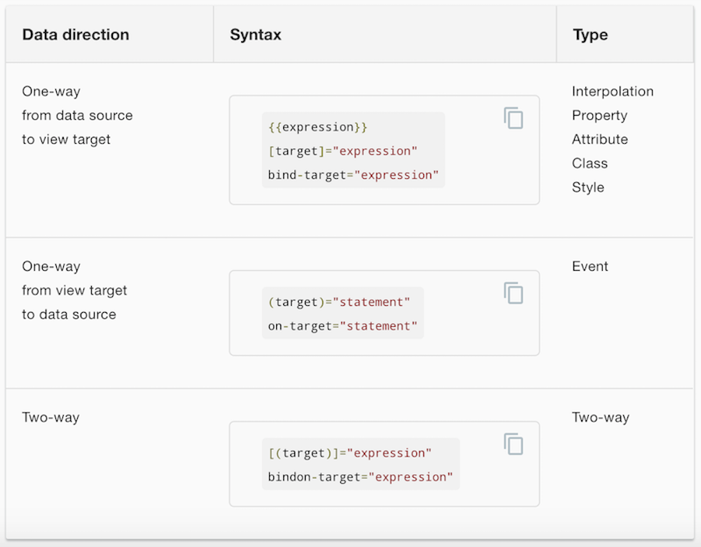
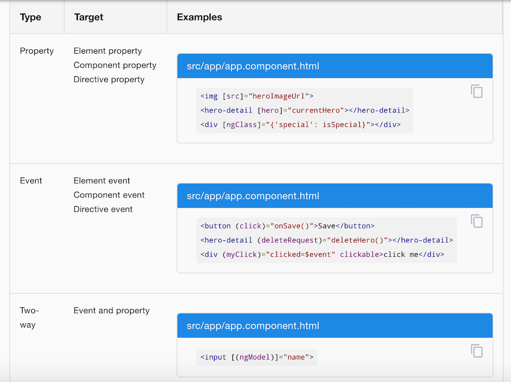
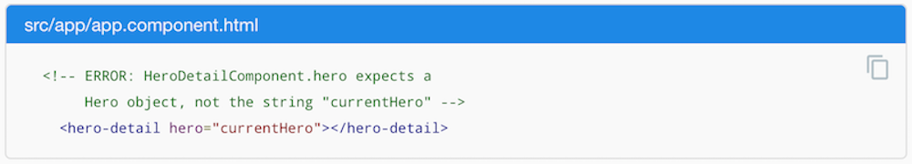

[](https://generalassemb.ly/education/web-development-immersive)


# Observables and Promises: Recap

## Promises

- A method that eventually produces a value.

Unlike in other languages, JavaScript statements can execute all at the same time, without waiting on the other to finish first. Promises make sure that if we want one statement to wait for another, it does. With promises, we say  "Do xxxx, then, when it's finished, do xxxx."

Importantly, promises only happen once. Once the event the promise is listening for resolves, the promise stops listening.

Promises, in general, look like this:

```js
var promise = new Promise(function(resolve, reject) {
  // do a thing, possibly async, (like call an API) then…

  if (/* everything turned out fine */) {
    resolve("Stuff worked!");
    // do whatever needs to happen if it works (like logging the results to the console)
  }
  else {
    reject(Error("It broke"));
    // throw an error if it didn't work (like if the API call was 404ed).
  }
});
```

And when we call that promise, we write that as:

```js
promise.then(function(result) {
  console.log(result); // "It worked!"
}, function(err) {
  console.log(err); // Error: "It broke"
});
```

If you'd like more promise recap, check out [this Google mammoth](https://developers.google.com/web/fundamentals/getting-started/primers/promises) on promises.

## Observables

- A piece of code which broadcasts events that other parts of your application can subscribe to.

The observable will broadcast events that happen (it's a publisher), and we can then tell components to subscribe to this publisher.  The components will be notified when an event happens and run some associated code.

Observables are used over promises when an event might occur more than once, so you don't want to stop listening the first time it happens! Observables also help us write DRY code - we can create an observable for an event and have multiple components listen to it, rather than writing the same promise multiple times.

## Resources

Here are some helpful links on Observables and Subjects to help clarify what they do.

- [Observable Intro](http://reactivex.io/documentation/observable.html)
- [Subject Intro](http://reactivex.io/documentation/subject.html) - Contains helpful links within as well
- [When to Use a Subject](http://davesexton.com/blog/post/To-Use-Subject-Or-Not-To-Use-Subject.aspx)
- [Marble Diagrams for Observables](http://rxmarbles.com/)
- [Simple Observable Example](http://embed.plnkr.co/CJNgwR8bhKv2qY1P8rGa)

## Angular Punctuation

Lastly, we've learned a lot of Angular punctuation so far.  Here is a quick review of what they all mean:





But sometimes we will see properties without the `[]`s around them.  What does that mean?  Well, if we have `[]`, we will evaluate the expression in Javascript.  If we don't, we will simply see the property as a string.  For example:


