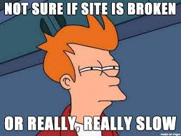

# Angular Universal



### Why is this important?

Angular got its start as an incredibly powerful front-end framework.  While it continues that trajectory, it has evolved beyond that.  To prevent front-end bloat and overtaxing the client, especially on mobile devices like phones and wearables, Angular Universal was created to seamlessly integrate server-side rendering and view caching.

This gives us the flexibility to lean on the back end when it is the better tool for any job.

### What are the objectives?
*After this workshop, developers will be able to:*

- **Integrate** Angular Universal into an Angular CLI project
- **Use** Angular Universal to render views on a Node server

### What is Angular Universal?

According to the official site, Angular Universal is "Server-side Rendering for Angular apps".

"I thought we didn't need server-side rendering, now that we have Angular," you may say.

Well, yes, except for a couple things:

1. As mentioned earlier, server-side rendering can really improve site performance if used properly.

2. Dynamic SPAs are really bad for SEO (Search Engine Optimization).

In this lesson, we will address the second issue.

### Setup

First, we'll need to create a new project with the Angular CLI called `first-angular-universal`.  If you can't remember how to do this, you can check earlier lessons.

Now, let's bring Angular Universal into the picture.  In order to do this, we will need something you have probably seen before: a Node server.

1. First, we will need to install the `platform-server` package and the `ts-node` package that will allow us to run `node` on a TypeScript file, so enter the `first-angular-universal` directory in Terminal and run the following command:

`npm install -S @angular/platform-server`
`npm install -D ts-node`

2. Next, we will need to connect the client to this Node server.  Open your `app.module.ts` file and replace the `BrowserModule` in the `imports` array with the following line:

```js
BrowserModule.withServerTransition({appId: 'cli-universal-demo'})
```

3. Now, we need to add our server module to our Angular app.  Create an `app.server.module.ts` in your `app` folder, and fill it out with the following code:

```js
import { NgModule } from '@angular/core';
import { ServerModule } from '@angular/platform-server';
import { AppModule } from './app.module';
import { AppComponent } from './app.component';

@NgModule({
  imports: [
    ServerModule,
    AppModule
  ],
  bootstrap: [AppComponent]
})
export class AppServerModule { }
```

4. Next, we will add compiler options to our `tsconfig.json` file:

```js
  "angularCompilerOptions": {
    "genDir": "./dist/ngfactory",
    "entryModule": "./src/app/app.module#AppModule"
  }
```

5. Now, we can add the `server.ts` file **in the `src` directory**:

```js
import 'reflect-metadata';
import 'zone.js/dist/zone-node';
import { platformServer, renderModuleFactory } from '@angular/platform-server'
import { enableProdMode } from '@angular/core'
import { AppServerModuleNgFactory } from '../dist/ngfactory/src/app/app.server.module.ngfactory'
import * as express from 'express';
import { readFileSync } from 'fs';
import { join } from 'path';

const PORT = 4000;

enableProdMode();

const app = express();

let template = readFileSync(join(__dirname, '..', 'dist', 'index.html')).toString();

app.engine('html', (_, options, callback) => {
  const opts = { document: template, url: options.req.url };

  renderModuleFactory(AppServerModuleNgFactory, opts)
    .then(html => callback(null, html));
});

app.set('view engine', 'html');
app.set('views', 'src')

app.get('*.*', express.static(join(__dirname, '..', 'dist')));

app.get('*', (req, res) => {
  res.render('index', { req });
});

app.listen(PORT, () => {
  console.log(`listening on http://localhost:${PORT}!`);
});
```

Look familiar?

Besides the code you're used to from a typical Node `server.js` file, this file includes the rendering factory and rules for rendering these HTML views and serving them to the front end.

6. Next, we will ignore `server.ts` in our `tsconfig.app.json` file:

```js
  "exclude": [
    "server.ts",
    "test.ts",
    "**/*.spec.ts"
  ]
```

7. Finally, we need to change our `package.json` scripts to run our transpiled `server.js` file instead of the default front-end-only webserver:

```json
  "scripts": {
    "prestart": "ng build --prod && ngc",
    "start": "ts-node src/server.ts"
  }
```

8. Now, make sure you are in the `first-angular-universal` directory and run `npm run start`.

9. Go to `http://localhost:4000` and you should see your app...but this time with a full back end!

Cool, right?  But we haven't changed any functionality yet, next we'll set our site up for easy searching.

### SEO

A cornerstone of on-page SEO factors are unique titles, meta descriptions and meta keywords. 

Let's add support for these to our fledgling app.

1. In `app.component.ts`, we need to add the `Meta` and `Title` packages:

```typescript
import { Meta, Title } from "@angular/platform-browser";
```

2. Add Meta and Title to a constructor function for your `AppComponent`:

```typescript
  constructor(meta: Meta, title: Title) {}
```

3. Then add a title and some meta tags for your app:

```typescript
title.setTitle('Our Very Professional Page');

meta.addTags([
  { name: 'author',   content: 'YOURNAMEHERE'},
  { name: 'keywords', content: 'angular seo, angular 4 universal, etc'},
  { name: 'description', content: 'This is my Angular SEO-based App, enjoy it!' }
]);
```

4. Go back to your browser, refresh the page, and inspect `Element` with `Dev Tools`.  You should see your title and meta tags now!  SEO FTW!!


### Resources

- [Angular Universal Official Page](https://universal.angular.io/)
- [Angular Universal Setup Tutorial](https://medium.com/@evertonrobertoauler/angular-4-universal-app-with-angular-cli-db8b53bba07d)
- [Newer Angular Universal Setup Tutorial](https://github.com/angular/angular-cli/wiki/stories-universal-rendering)
- [Making Angular SEO Friendly](https://coursetro.com/posts/code/68/Make-your-Angular-App-SEO-Friendly-(Angular-4-+-Universal))
- [Angular Universal Pitch](http://dev.sebastienlucas.com/universal-angular/)
- [Angular Universal Docs](https://github.com/angular/universal)